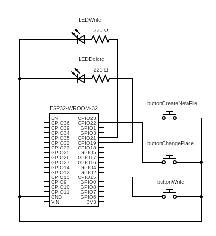

# WifiSignalLogger-ESP32

This project is meant to be a Wifi Strength manual data logger built with an ESP32-WROOM-32.

Made by:
- Gustavo Gomes ([Gustavo0022](https://github.com/Gustavo0022)) 
- Lucas Santana ([LucaskaSL](https://github.com/LucaskaSL))
- Irlan Felipe ([IrlanS0](https://github.com/IrlanS0))
- Paulo Medeiros([PauloBaja](https://github.com/PauloBaja))

## Used Libraries

- [Wifi.h](https://github.com/espressif/arduino-esp32/blob/master/libraries/WiFi)
- [SimpleFTPServer](https://github.com/xreef/SimpleFTPServer)
- [LittleFS](https://github.com/littlefs-project/littlefs)

## Usage

### Configuration & Setup

- Credentials: Open [WiFiSignalLogger.ino](./src/WiFiSignalLogger.ino) in the Arduino IDE and update the `ssid` and `password` variables with your network details.

- Deployment: Connect your ESP32 and upload the code.

- Monitoring: Open the Serial Monitor at a baud rate of 115200 baud. The board will display the connection status and the IP Address.

###  Accessing Your Data (FTP)

To retrieve your measurements, use an FTP client (like FileZilla or a mobile file explorer) while connected to the same network:

- Host: [The IP address from Serial Monitor]

- Username: esp32

- Password: esp32

- File: Look for TesteWifi.csv in the root directory.

### Hardware control

|Action	| Physical Control| 	Visual Feedback | 
|:---|:----:|:-----:|
|Log Data Point |	White Button (GPIO 15) |	LEDWrite (GPIO 21) Flashes |
|Calculate Place Avg	| Red Button (GPIO 22)	| Both LEDs may flash |
|Delete All Data	| Reset Button (GPIO 23)	| LEDDelete (GPIO 19) Flashes |

## How does it work

### Point measurement

### 

## Schematic
The main schematic is displayed below, showing every peripheral connected to the ESP32 board

.

